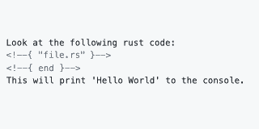

`md-inc` - Include files in Markdown docs
=========================


## Overview


* Include external files into your markdown documents - inline!
    * Input is inserted between command block and end block
    * Overwrites anything that was previously there
* Transform included files
    * Wrap your input in code blocks or custom text
    * Filter specific lines
    * Add line numbers or other line decorators
* Easily configure with `.md-inc.toml` file.
    * Specify 1 or more files to transform.
    * Specify base path used for relative file includes.
    * Replace `<!--{` and `}-->` tags - useful if you need to avoid conflicts or existing comments.
    
## Example

Here is a code file, `file.rs`, that we want to include in our Markdown document:

<!--{{ file.rs | code: rust }}-->
```rust
fn main() {
    println!("Hello, World!");
}
```
<!--{{ end }}-->

The file can be included using command tags, sneakily disguised as comments so they aren't rendered in the actual document:
<!--{{ before/basic_example.md | code: markdown }}-->
```markdown
Look at the following rust code:
<!--{ "file.rs" | code: rust }-->
<!--{ end }-->
This will print 'Hello World' to the console.
```
<!--{{ end }}-->


After running `md-inc`, the file will be transformed into:
<!--{{ after/basic_example.md | code: markdown | wrap: "`" }}-->
````markdown
Look at the following rust code:
<!--{ "file.rs" | code: rust }-->
```rust
fn main() {
    println!("Hello, World!");
}
```
<!--{ end }-->
This will print 'Hello World' to the console.
````
<!--{{ end }}-->

Note: The surrounding ` ```rust ` and ` ``` ` lines were inserted
because we piped the input into the `code: rust` command. More on this later!

## Install
```bash
cargo install md-inc
```

## Run
```bash
md-inc [FLAGS] [OPTIONS] [files]...
```

If no files are given, the `files` field in `.md-inc.toml` is used.

## Configuration

`.md-inc.toml` can be configured by setting any of the following:

`open_tag`: The opening tag for a command 
```toml
# <!--{ COMMAND }-->
# ^^^^^
open_tag = "<!--{" 
```

`close_tag`: The closing tag for a command 
```toml
# <!--{ COMMAND }-->
#               ^^^^
close_tag = "}-->"
```

`end_command`: The name to use for the end command
```toml
# <!--{ COMMAND }-->
# <<FILE_CONTENTS>>
# <!--{ end }-->
#       ^^^
end_command = "end"
```

`base_dir`: The base directory for relative imported file paths, relative to the config file
```toml
# For the directory tree:
#   ├╼ README.md
#   ├╼ .md-inc.toml
#   ╰╼ doc
#     ├╼ file.txt
#     ╰╼ other
#       ╰╼ file2.txt
# If base_dir = "doc", then files can be named relative to doc
# <!--{ "file.txt" }-->
# ...
# <!--{ "other/file2.txt" }-->
base_dir = "doc"
```
`files`: A list of files to be transformed, relative to the config file
```toml
files = ["README.md", "doc/file.md"]
```
`depend_dirs`: 
A list of directories containing ".md-inc.toml" that will be visited before this one. 
```toml
depend_dirs = ["doc/example1", "doc/example2"]
```

`next_dirs`: 
A list of directories containing ".md-inc.toml" that will be visited after this one. 
```toml
next_dirs = ["doc/example1", "doc/example2"]
```
*Note*: "depend_dirs" and "next_dirs" are NOT called recursively.


`out_dir`: 
An optional output directory for generated files. 
If this is defined, the generated files will be written to this directory 
instead of overwriting the original files.
```toml
out_dir = "path/to/output"
```


## Commands
Included files can be manipulated by piping commands together.

* [General Syntax](#general-syntax)
* [Code Blocks](#code-language)
* [Lines Range](#lines-first-last)
    * [After](#trim-leading-lines)
    * [Before](#trim-trailing-lines)
    * [Between](#trim-both-leading-and-trailing-lines)
* [Line List](#line-list)
* [Line Numbers](#line-numbers-separator)
* [Wrap Document](#wrap-text-or-wrap-before-after)
* [Wrap Lines](#wrap-lines-text-or-wrap-lines-before-after)

### General Syntax:
Include `file.txt`:
```markdown
<!--{ "file.txt }-->
<!--{ end }-->
```
Include `file.txt` inside a code block:
```markdown
<!--{ "file.txt | code }-->
<!--{ end }-->
```
Include `file.py` inside a code block with python syntax highlighting:
```markdown
<!--{ "file.py" | code: python }-->
<!--{ end }-->
```
Include only lines 4 to 10 of `file.py` inside a code block with python syntax highlighting:
```markdown
<!--{ "file.py" | lines: 4 10 | code: python }-->
<!--{ end }-->
```

* The first value should always be the filename.
* Commands can be chained together using the pipe (`|`) operator.
    `"file.txt" | code`
* Some commands may take space-separated arguments after a colon (`:`) character.
    `"file.txt | lines: 4 10`
* Commands are applied to the included file from left to right.


### `code: [language]`
* Wraps the file in a code block (triple backticks)
* `language`: the language used for syntax highlighting. 
If given, this will be added directly after the top backticks.

Without language:
````markdown
<!--{ "doc/file.txt" | code }-->
```
FILE_CONTENTS
```
<!--{ end }-->
````

With language:
````markdown
<!--{ "doc/file.html" | code: html }-->
```html
FILE_CONTENTS
```
<!--{ end }-->
````

### `lines: first [last]`
* Restricts the input to the given range of lines 
    * (include line, if `first <= line <= last`)
* `first`: The first line to import
* `last`: The last line to import  (1-based index)
    * If `last` is not provided, all lines will be included from `first` until the end of the input.

Given the file, *alphabet.txt*: 
<!--{{ "alphabet.txt" | code: txt }}-->
```txt
A
B
C
D
E
```
<!--{{ end }}-->


#### Trim leading lines
*Input:*
<!--{{ "before/trim_leading.md" | code: markdown | wrap: "`" }}-->
````markdown
<!--{ "alphabet.txt" | lines: 4 }-->
<!--{ end }-->
````
<!--{{ end }}-->

This keeps the 4th line until the end of the file.

*Output:*
<!--{{ "after/trim_leading.md" | code: markdown | wrap: "`" }}-->
````markdown
<!--{ "alphabet.txt" | lines: 4 }-->
D
E
<!--{ end }-->
````
<!--{{ end }}-->


#### Trim trailing lines
*Input:*
<!--{{ "before/trim_trailing.md" | code: markdown | wrap: "`" }}-->
````markdown
<!--{ "alphabet.txt" | lines: 1 3 }-->
<!--{ end }-->
````
<!--{{ end }}-->

This keeps only lines 1 to 3
*Output:*
<!--{{ "after/trim_trailing.md" | code: markdown | wrap: "`" }}-->
````markdown
<!--{ "alphabet.txt" | lines: 1 3 }-->
A
B
C
<!--{ end }-->
````
<!--{{ end }}-->

#### Trim both leading and trailing lines
*Input:*
<!--{{ "before/trim_both.md" | code: markdown | wrap: "`" }}-->
````markdown
<!--{ "alphabet.txt" | lines: 2 4 }-->
<!--{ end }-->
````
<!--{{ end }}-->

This keeps only lines 2 to 4

*Output:*
<!--{{ "after/trim_both.md" | code: markdown | wrap: "`" }}-->
````markdown
<!--{ "alphabet.txt" | lines: 2 4 }-->
B
C
D
<!--{ end }-->
````
<!--{{ end }}-->


### `line: list...`
* Restricts the input to the given list of line numbers (1-based index).
* `list...`: A list of line numbers to included

*Input:*
<!--{{ "before/line_list.md" | code: markdown | wrap: "`" }}-->
````markdown
<!--{ "alphabet.txt" | line: 3 2 1 }-->
<!--{ end }-->
````
<!--{{ end }}-->

*Output:*
<!--{{ "after/line_list.md" | code: markdown | wrap: "`" }}-->
````markdown
<!--{ "alphabet.txt" | line: 3 2 1 }-->
C
B
A
<!--{ end }-->
````
<!--{{ end }}-->


### `line-numbers: [separator]`
* Adds a line number to each line
* `[separator]`: Optional separator used between the line number and the rest of the line.
    * If not provided, `: ` is used.

*Input:*
<!--{{ "before/line_numbers.md" | code: markdown | wrap: "`" }}-->
````markdown
<!--{ "alphabet.txt" | line-numbers: " " }-->
<!--{ end }-->
````
<!--{{ end }}-->

*Output:*
<!--{{ "after/line_numbers.md" | code: markdown | wrap: "`" }}-->
````markdown
<!--{ "alphabet.txt" | line-numbers: " " }-->
1 A
2 B
3 C
4 D
5 E
<!--{ end }-->
````
<!--{{ end }}-->


### `wrap: text` or `wrap: before after` 
* Inserts text before and after the input.
* `text`: Text that is inserted before and after the input (no newline)
* `before`: Text that is inserted before the input (no newline). 
* `after`: Text that is inserted after the input (no newline). 


### `wrap-lines: text` or `wrap-lines: before after` 
* Inserts text before and after each line of the input.
* `text`: Text that is inserted before and after each line of the input.
* `before`: Text that is inserted before each line of the input. 
* `after`: Text that is inserted after each line of the input. 


### `match: pattern [group_num]`
* Inserts text from a file that matches the pattern.
* `pattern`: A regex pattern
* `group_num`: The capture group matching `group_num` is inserted. 
    * A group_num of `0` is the whole regex pattern

For a file, `hello_world.rs`:
<!--{{ "hello_world.rs" | code: rust }}-->
```rust
// Main
fn main() {
    println!("Hello, World!");
}
// Goodbye
fn goodbye() {
    println!("Goodbye, World!");
}
```
<!--{{ end }}-->


The `main()` function can be extracted using the `match` command:

*Input:*
<!--{{ "before/match.md" | code: markdown | wrap: "`" }}-->
````markdown
<!--{ "hello_world.rs" | match: "\n(fn main[\s\S]*?\n\})" 1 | code: rust }-->
<!--{ end }-->
````
<!--{{ end }}-->

*Output:*
<!--{{ "after/match.md" | code: markdown | wrap: "`" }}-->
````markdown
<!--{ "hello_world.rs" | match: "\n(fn main[\s\S]*?\n\})" 1 | code: rust }-->
```rust
fn main() {
    println!("Hello, World!");
}
```
<!--{ end }-->
````
<!--{{ end }}-->
